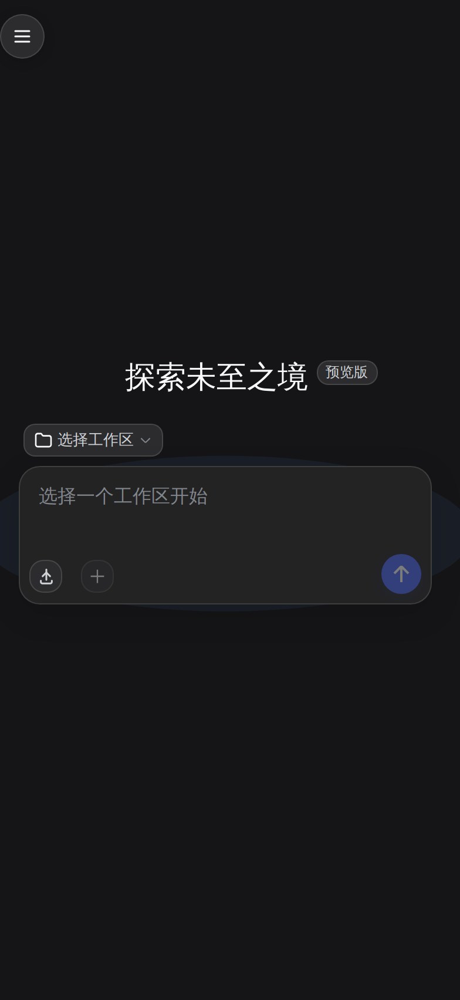

# ds-mobile-skin

[](https://github.com/wenyixiaoqingnian/ds-mobile-skin/actions)
[](LICENSE)
[](https://github.com/wenyixiaoqingnian/ds-mobile-skin)
[](#)

> **让 DSH Web GUI 在手机端拥有 DeepSeek 官方 App 一样的体验。**
> 干净的深蓝品牌色、扁平化界面、底部输入、悬浮菜单球、附件上传——加上一个「今日」计费面板。



---

## 📱 预览

**主页**（带 ☰ 悬浮菜单球 + 底部 composer + 品牌蓝 #4D6BFE）：


> 纯前端（浏览器侧）改动，**不触碰**任何聊天会话、模型配置、密钥等数据。
> 截图仅展示 UI 风格，不含真实数据。

---

## ✨ 功能

### 📱 手机端 App 化（`plugin/`，独立插件包）

- **品牌化视觉**：品牌蓝 `#4D6BFE`、扁平化、app 质感；桌面端不受影响
- **悬浮菜单球 ☰**：可拖拽、自动贴边、位置记忆（localStorage）；抽屉打开时自动隐藏
- **上传附件**：在输入工具栏注入上传按钮，复用产品自身上传通道
- **自动收起键盘**：切换会话时主动 blur 输入框，避免手机键盘弹起
- **弹层定位**：菜单/下拉/弹窗自动锚定在触发按钮上方

### 💰 计费功能增强（`patches/`，对 `dsh-token-viewer` 的补丁）

- **「今日」面板**：侧栏统计**今天零点至今**的消费（本地午夜自动归零）
- **总成本保留两位小数**
- **日志排序**：按花费降序、最多 10 条
- **移动端布局**：详情面板全屏、双列迷你统计、窄屏适配
- **NaN 修复**：侧栏「未缓存输入」字段使用正确来源

---

## 🚀 安装

### 1. 安装插件（手机端 App 化）

```bash
# 从本仓库目录安装到 web profile
dsh plugin --profile web add /path/to/ds-mobile-skin/plugin

# 或作为本地依赖加入 profile
cd ~/.dsh/profiles/web
pnpm add file:/path/to/ds-mobile-skin/plugin
pnpm install
```

**硬刷新浏览器**（Ctrl/Cmd+Shift+R）即可生效 —— 客户端代码每次请求都从磁盘读取，无需重启服务。

> ⚠️ **插件包名必须保持 `ds-mobile-skin`**。部分部署环境的 `dsh-profile-guard` 会按名删除特定插件（旧名 `dsh-web-deepseek-mobile`），改名即可绕过该名单。

### 2. 应用计费补丁（可选）

```bash
cd patches/dsh-token-viewer
./apply-patch.sh          # 自动定位 ~/.dsh/profiles/web/node_modules/dsh-token-viewer/lib/client.js
```

脚本行为：自动备份、幂等、校验标记。每次 `pnpm install` 后需重跑。

---

## 📦 仓库结构

```
ds-mobile-skin/
├── plugin/                          # 可安装的插件包
│   ├── package.json
│   ├── cordis.patch.yml
│   └── lib/{index.js,client.js}
├── patches/
│   └── dsh-token-viewer/
│       ├── client.js.diff
│       └── apply-patch.sh
├── docs/                            # 截图
├── .github/
│   ├── scripts/validate-diff.py
│   └── workflows/build.yml
├── LICENSE                          # MIT
└── README.md
```

---

## 🔒 隐私

- **不包含**任何聊天会话、模型配置、API 密钥
- 仅在浏览器侧注入 CSS 与少量交互 JS
- `localStorage` 仅用于记忆悬浮球位置

---

## 🛠 开发

硬刷新浏览器即可看到效果（服务端每次请求都重新读取 `client.js`）。重新生成补丁：

```bash
diff -u <原始 client.js> <当前 client.js> > patches/dsh-token-viewer/client.js.diff
```

---

## 📄 许可证

[MIT](LICENSE)
